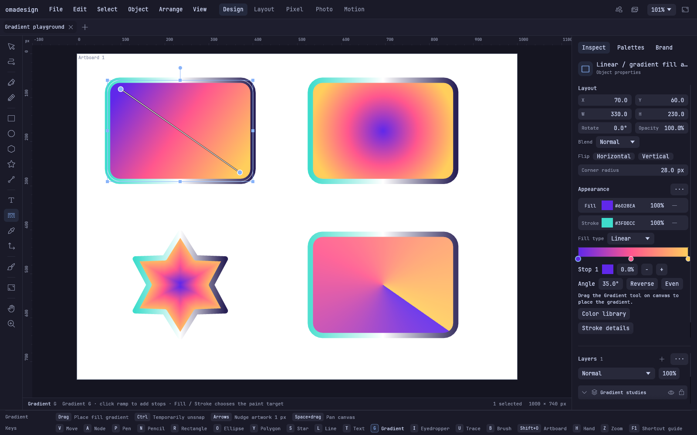

# More control on the canvas

Version **0.5.4** brings chroma key and two banks of raster treatments to Pixel,
four kinds of editable gradients to Design, and a fuller Layout workspace for
responsive screens and prototypes. Color, transparency and the layer tree now
work together across those studios.

This release includes the **0.5.3 clipboard fixes and cloud collaboration**.
Paste a screenshot, an image file, text or SVG with Ctrl+V. External content still
lands in the visible canvas center; artwork copied inside Omadesign keeps its
position. Cloud continues to share versioned project files, assets and review
snapshots through explicit uploads.

## Key out a background in Pixel

Select a pixel layer, open **Raster studio → Filters → Key & transparency → Chroma key**, and choose Green, Blue or
**Sample image**. Sampling reads the original photo, so you can change the key
without chasing colors altered by the preview.

- **Similarity** controls how close a color must be to the sampled key.
- **Falloff** creates a soft transition into transparency.
- **Hardness** tightens that transition.
- **Spill cleanup** reduces leftover key color around the edges.
- **Flow** blends the keyed result with the original for this application.

The preview shows transparency on a checkerboard. Switch between **Original**
and **Preview** while adjusting. **Apply** processes the full-resolution image
in the background and creates one Undo step; **Cancel** leaves the document
alone. Existing transparency is preserved, and active pixel selections limit
where the result is applied. Layer masks remain available for local cleanup.

Chroma key removes a color, so objects and studio equipment that do not match
that color remain. It is not an automatic subject-selection tool.

## 17 raster filters, 13 raster effects

The banks live in Pixel mode and share preview, comparison, strength, Apply and
Undo. They can also process the active layer mask.

| Bank | Included treatments |
| --- | --- |
| Filters · key and transparency | Chroma key, Alpha threshold, Feather alpha, Grow alpha, Shrink alpha |
| Filters · color and tone | Brightness / contrast, Exposure / gamma, Levels, Hue / saturation, Vibrance, Color balance, Temperature / tint, Grayscale, Sepia, Invert, Threshold, Posterize |
| Effects · blur and detail | Gaussian blur, Motion blur, Sharpen, Unsharp mask, Find edges, Emboss |
| Effects · stylize and distort | Pixelate, Film grain, Vignette, Halftone, Solarize, Swirl, Ripple |

These are **applied pixel edits**, not a live adjustable raster effect stack.
Duplicate a layer before applying when you want to retain an independent
original. The dialog uses a smaller preview for responsiveness; fine detail can
differ from the full-resolution result.

## Gradients for fills and strokes



Select an object, open **Appearance**, and choose a gradient for its fill or
stroke. The Gradient tool edits the chosen target on the canvas.

- **Linear** follows the gradient direction.
- **Radial** spreads outward from its starting point.
- **Shape** follows the object's silhouette, including holes.
- **Conic** sweeps colors around its center.

Add or remove stops, drag them along the ramp, set an exact percentage and edit
each stop's color and alpha. Reverse the order or space the stops evenly. Angle
controls rotate linear, radial and conic gradients; canvas handles adjust their
placement. Stroke gradients work with the existing width, cap, join and dash
controls. Gradient edits are undoable and remain editable in `.oma` documents.

Linear and radial SVG exports retain editable gradient stops. Shape and conic
SVG exports use embedded image patterns, capped at **4096 pixels per axis**.
Lottie reports shape and conic gradients as unsupported; animated SVG preserves
their rendered appearance.

## See the color you are changing

The color picker keeps the saturation × brightness box and adds **Current** and
**Previous** chips beside it. Click Previous to restore the color from before
that edit. Alpha is available in every picker, including gradient stops,
Design effect colors, paint and Layout color variables. Eight-digit hex uses
`#RRGGBBAA`.

Vector objects and Layout frames have their own **Opacity** and **Blend**
controls. Placed raster layers use their layer controls. An object's opacity is
applied once to its combined fill, image and stroke; a frame's opacity applies
to its entire subtree. Choose from the 16 existing blend modes, including
Multiply, Screen, Overlay, Difference, Hue and Luminosity.

Regular layers and frames isolate their contents: an object's blend mode
interacts with siblings in the same container, and the container's blend mode
interacts with artwork below it. Layer groups can enable **Pass through** when
child layers should blend with the outside backdrop.

## Arrange the hierarchy directly

Drag objects and layers between rows to reorder them in the sidebars. Drop onto
the center of a group or Layout frame to nest. Multi-object moves and frame
subtrees preserve their hierarchy; invalid cycles and locked destinations are
rejected. Each move undoes as one action.

| Shortcut | Action |
| --- | --- |
| Ctrl+G | Create an editable layer group |
| Ctrl+Shift+G | Ungroup |
| Ctrl+8 | Make a compound shape |
| Ctrl+Shift+8 | Release a compound shape |

Grouping keeps separate objects. Pathfinder operations such as Union remain
available separately. Dragging a placed raster image into a Layout frame
converts it to an embedded image object and retains its placement and
appearance. If it has a layer mask, that mask is **baked into the image alpha**;
Undo restores the original layer and editable mask.

## Layout grows into a responsive workspace

Layout now includes **Stack, Wrap and Grid**, independent Fixed/Hug/Fill sizing,
min/max dimensions, per-side padding, absolute children, clipping and aspect
ratio controls. Phone and Tablet breakpoint overrides change layout direction,
spacing, column count and text size. Resizing back to desktop restores the
authored base settings.

Create document-local components, insert linked instances and add variants.
Text and appearance overrides survive changes to the main component. Reset an
instance or detach it when it should become independent. Color and number
variables can drive fills, strokes, gaps, padding and corners.

Placed images embed into the document with Fill, Fit or Stretch fitting and
focal-point controls. Icons, photos, brand assets and placed SVGs use the chosen
frame, including nested frames. The sidebar and canvas support moving artwork
between frames and layers.

Use **Present** to try Click, Hover and Press interactions: Navigate, Back,
Open overlay, Close overlay and Change variant. Choose Instant, Dissolve or
Slide transitions, then test viewport widths without changing the source.
Export a frame as PNG, SVG or standalone responsive HTML with embedded assets
and the supported prototype interactions. The editable **Fieldwork starter**
provides a place to explore the workflow.

Layout does not import native Figma or Framer projects. Components and variables
belong to one document, Grid uses uniform columns, and text remains a single
styled run. The HTML export is a design/prototype artifact; it does not provide
a CMS, application backend or hosting.

## Existing workflows stay available

The 0.5.3 native clipboard path remains in this release, including Omarchy
clipboard-history paste and editable text insertion. Pixel selections,
painting, RAW development, photo batches, motion, templates and portable brand
kits remain available. Pixel selection tint now follows the rotation and scale
of a placed image instead of stretching across a screen-aligned box.

Copying artwork out of rotated Layout frames preserves its canvas placement.
Component definitions and instances remap their links when copied together;
instances keep an existing local definition when available. Pasting into a
document without the referenced component or variable detaches that link while
retaining editable artwork and its current appearance. Mixed raster/vector
copies preserve gradients, opacity and blend settings across windows.

Cloud retains verified sign-in, project files and assets, member roles,
versioned snapshot comments and annotations, and explicit showcase publishing.
There is no simultaneous multi-user canvas editing or browser authoring. See
the [cloud guide](/docs/cloud) for the sharing and review workflow.

**Editable vector-object masks are not included in 0.5.4.** Existing layer masks
are pixel masks, including when they mask a vector layer. A rectangle or other
vector cannot yet serve as a live layer or image mask.

0.5.4 opens older `.oma` documents. Documents saved with the new gradient types
require **0.5.4 or later**; 0.5.3 does not understand the new gradient data.
Keep a separate original if you need to return to an older app version.

## Install or update

```sh
curl -fsSL https://omadesign.app/install | sh
```

Relaunch Omadesign, then run `omadesign --version` or
`~/.local/bin/omadesign --version` to confirm **0.5.4**. Linux packages support
ARM64 and x86_64 and retain the glibc 2.35 compatibility ceiling.

The [user manual](/docs/manual) explains the controls. The
[release validation record](../releases/0.5.4.md) records the final tests,
artifacts and runtime checks.
