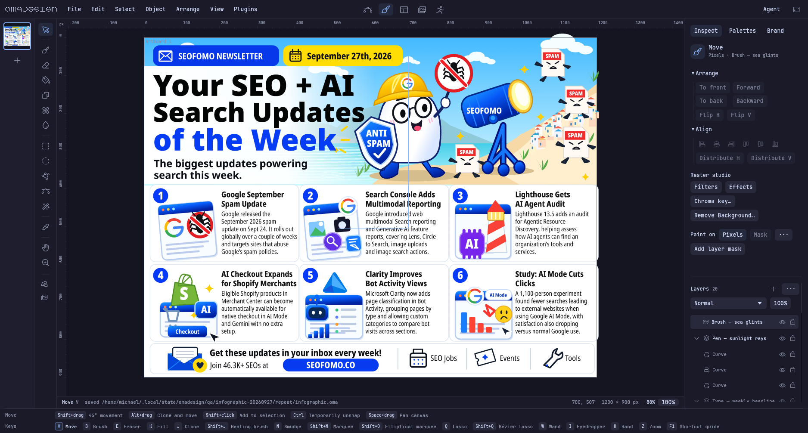

# Everyday authoring on hpeliteclient

**Functional pass, responsiveness fail.** The supplied infographic was rebuilt
as an editable vector approximation, then used for real native pen, brush,
typing, pan, zoom, undo/redo and persistence checks on hpeliteclient. This does
not establish a comfortable workflow on the four-core machine: common canvas
updates take 100–160 ms, with typing stalls above one second.

This is additional QA for [PR #147](https://github.com/michaelmonetized/omadesign/pull/147),
stacked on #146. Production code is the same installed 0.6.0 build already
documented in [the AI field report](hpeliteclient-2026-09-27.md). No renderer
optimization or application release is claimed by this QA-only follow-up.

## Workload and artifact

The original user image is 1195 × 896. The reconstruction is 1200 × 900 with
20 layers, 576 vector shapes (including **79 live text objects**), and one
raster brush layer. Fonts are archived in the adjacent `.omabrand` directory;
no reference-image pixels are embedded. It reproduces the layout, copy, mascot,
icons and color scheme in a simpler vector style, rather than matching the
original's rendered textures exactly.

The illustration and card copy were authored through SVG interchange. The
native QA starts with that dense editable scene, then **types five headline
objects character by character (83 input events), draws three Pen paths and
three continuous Brush strokes**, and exercises navigation and persistence.
It is not a claim that the entire infographic was manually drawn in the UI or
that a person could design it in the automated test's running time.




The full portable artwork, font files and licenses are delivered locally at
`artifacts/hpeliteclient-infographic-20260927/editable-infographic.zip` and on
the target under `~/.local/state/omadesign/qa/infographic-20260927/deliverable/`.
An accessible copy is in `~/Documents/Omadesign/SEOFOMO-20260927/` on the HP.
Keep `.omabrand` alongside `infographic.oma` when copying it elsewhere.

## Measurement

Two serial native WGPU runs used the actual desktop and a fresh isolated app
profile, with networking disabled by `unshare -Urn`. Existing applications
remained running. The Hyprland tiled window was 1876 × 1006; the measured canvas
was 1456 × 876. The harness uses `Studio::ui`, including ordinary job polling,
and injects real egui pointer/key events through the native input hook.
Document geometry for the measured additions is created by the actual tools.

These numbers measure **CPU processing of a UI update**, not GPU presentation
latency. Raw input-to-UI timings and frame intervals are retained in the JSON.
They exclude human decisions, authoring time, and screenshot encoding. Tests
assert that typing, brush, pan and zoom really invalidate/update the canvas;
pen rubber-band preview normally reuses the existing canvas texture.

| Operation | First run median / p95 | Repeat median / p95 | Repeat frames |
| --- | ---: | ---: | ---: |
| Pen preview | 2.7 / 9.8 ms | 2.2 / 3.1 ms | 48 |
| Pen commit | 115.3 / 215.8 ms | 101.3 / 111.1 ms | 3 |
| Typing | 128.9 / 431.2 ms | **158.3 / 479.1 ms** | 83 |
| Brush drag | 143.4 / 451.4 ms | **103.6 / 168.3 ms** | 90 |
| Pan | 99.1 / 224.0 ms | 112.6 / 201.1 ms | 40 |
| Zoom | 133.2 / 726.4 ms | 105.0 / 160.4 ms | 60 |

Repeat typing maximum: **1107.3 ms**. Repeat median frame intervals were
167.2 ms typing, 112.1 ms brush, 120.0 ms pan and 112.0 ms zoom. Save consumed
452 ms in its one measured UI update. Idle medians were below 3 ms, but idle
also had spikes under the existing desktop load. Small sample counts for pen
commit and save are explicitly shown; their tails are not stable estimates.

The first service had a 1 GiB memory and 512 MiB swap ceiling, default CPU
weight and no CPU quota. It completed in 77.2 seconds including startup,
with 470.8 MiB aggregate cgroup memory peak and 109 MiB swap peak. The repeat
removed those test-specific ceilings and still failed the responsiveness
check. Its whole process took 66.03 seconds, with **168.96 MiB peak process
RSS** and 5,705 major page faults. Cgroup memory and process RSS are different
measurements and must not be compared as a memory improvement.

The repeat started with 1,064 MiB available of 5,790 MiB usable RAM and about
3,791 MiB of swap occupied. Global CPU/memory pressure varied substantially;
the before/after samples are preserved. These are representative observations
of the user's busy machine, not a controlled hardware throughput claim.

## Correctness and bottleneck evidence

- The five typed strings exist as editable text in the document.
- Three real Pen paths and nonempty Brush pixels were committed.
- Native Ctrl+Z removed the last brush stroke; Ctrl+Shift+Z restored identical
  pixels. Native Ctrl+S persisted the result. Reopening produced the exact same
  encoded document value.
- The actual installed `~/.local/bin/omadesign` reopened the saved project
  offline and captured it through WGPU. Its hash remains
  `fd293af0d47e2bfda8550a1c2107177060b8e0a9d41785f299c9f5849f9091d8`.
- [Installed-app capture](authoring-hpeliteclient-2026-09-27/installed-reopened.png).
- The current `src/ui/canvas.rs` calls the CPU compositor synchronously whenever
  the canvas key changes. Every measured typing/brush/zoom update changed it.
  A separate CPU-only attribution run rendered the complete saved document at
  1456 × 900: median of three warm calls was **66.48 ms**. This establishes a
  substantial redraw cost independently of AI inference. It does not attribute
  every UI stall to that renderer; paging, UI work and desktop load also matter.

The next performance work should reduce full-scene redraws while editing and
navigating, with pixel-equivalence checks for masks, groups, blending and
filters. This report deliberately records the failure rather than treating
working tools and low idle time as a smooth-performance pass.

## Reproduction and evidence

- [Native workload](../../src/bin/authoring_qa.rs),
  [CPU attribution utility](../../src/bin/canvas_profile.rs).
- [First raw run](authoring-hpeliteclient-2026-09-27/baseline-result.json),
  [repeat raw run](authoring-hpeliteclient-2026-09-27/repeat-result.json),
  [repeat resources](authoring-hpeliteclient-2026-09-27/repeat-resources.json),
  [CPU attribution](authoring-hpeliteclient-2026-09-27/canvas-profile.json).
- [Input/output hashes](authoring-hpeliteclient-2026-09-27/manifest.json).
- [Artwork generator](authoring-hpeliteclient-2026-09-27/build_artwork.py),
  [layer organization](authoring-hpeliteclient-2026-09-27/organize_layers.py),
  [portable fonts](authoring-hpeliteclient-2026-09-27/portable_fonts.py),
  [target runner](authoring-hpeliteclient-2026-09-27/run_authoring.py).

The artwork generator needs Python Pillow and the Noto/Noto Nerd Font faces
referenced in its source. Generate both SVGs, convert each with
`omadesign --convert INPUT.svg --output INPUT.oma`, run `organize_layers.py`,
then `portable_fonts.py`. The delivered native files already include their
font bank and do not require those faces to be installed globally.

Build locally with the same cross toolchain used for the installed x86 package:

```sh
CARGO_PROFILE_RELEASE_LTO=false OMA_RAW_CXX_STDLIB=c++ \
CC_x86_64_unknown_linux_gnu="$PWD/scripts/zig-cc-x86_64" \
CXX_x86_64_unknown_linux_gnu="$PWD/scripts/zig-cxx-x86_64" \
CARGO_TARGET_X86_64_UNKNOWN_LINUX_GNU_LINKER="$PWD/scripts/zig-cc-x86_64" \
cargo build --locked --offline --release --target x86_64-unknown-linux-gnu \
  --bin authoring_qa --bin canvas_profile
```

Copy the binaries, seed `.oma`, `type-tasks.json` and adjacent `.omabrand` to
the target. Launch `authoring_qa SEED TASKS OUTPUT_DIRECTORY` through its
systemd user manager to inherit the existing Wayland session. Use a fresh
output directory. The runner records `wait4` resource usage and host pressure.
Both QA binaries passed offline Cargo checks and formatting checks; both
native runs completed every assertion. Production code was unchanged.
