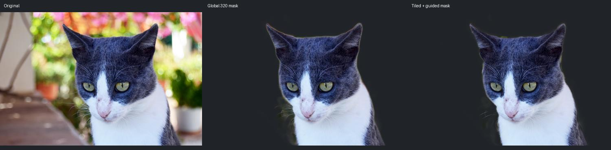
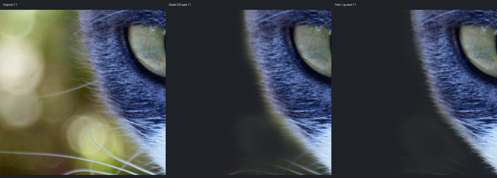
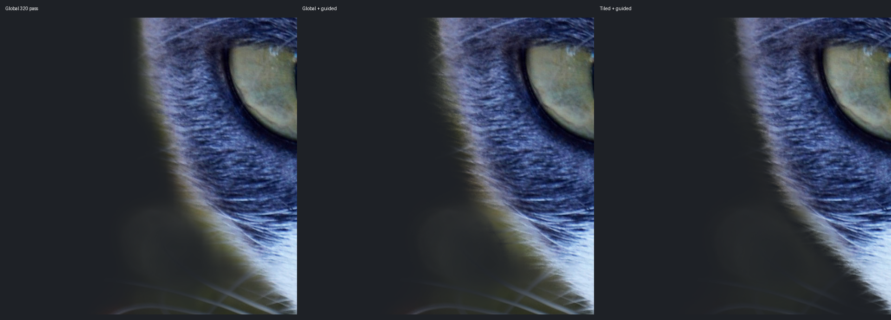
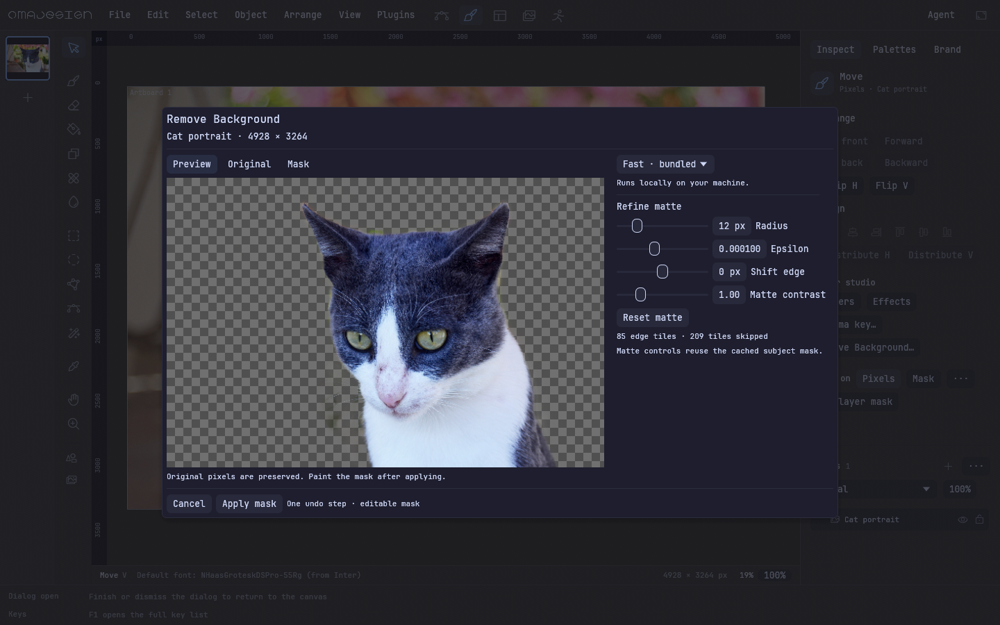
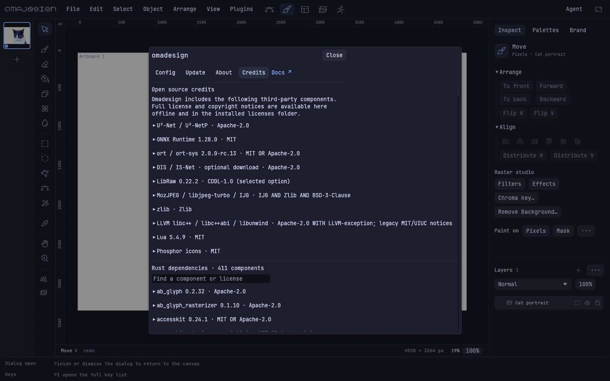

# Offline Pixel background removal — local QA, 2026-09-27

Issue #144, stacked on PR #142 (`30ebe3f1c81b2215d241c7f7827732df0da6041f`). This delivers the core in the issue's stated ordering. Real-ESRGAN upscale-first and upscale-cutout remain assigned to #145; GPU providers, quantization and foreground decontamination are stretch goals and are not shipped here.

## Implementation and boundaries

- Pixel-only entry beside Chroma key and in Filters → Key & transparency. An active, editable pixel layer is required. Selection bounds restrict model work; the final matte blends by the selection coverage and preserves the existing mask outside it.
- Embedded, unchanged U²-NetP with the exact size/SHA-256 from the issue. Optional U²-Net and IS-Net downloads require an explicit button; size and SHA-256 are verified before atomic installation, and every load rechecks them. Failed or cancelled downloads leave the prior file intact.
- ONNX Runtime 1.28.0 loaded dynamically from the archive or installed data directory. Both architecture archives are pinned by SHA-256. There is no runtime auto-download.
- Aspect-preserving global letterbox; native-size tiles with 25% overlap and padded edges; only ambiguous boundary tiles run inference. Raw sigmoid probabilities, Hann accumulation/normalization, and a confidence-weighted global prior prevent each tile from inventing its own subject. No per-tile min/max stretch.
- The pinned exports have static N=1, so bounded inference chunks contain one tile. The same path supports dynamic-batch exports with bounded chunks. CPU is the shipped execution provider.
- Full-resolution luma guided filter; radius, epsilon, edge shift, matte contrast, and optional existing-mask intersection. One cached raw/rough result is retained per dialog context, keyed by document, layer ID, dimensions, pixel version, model, and selection generation, with source-data comparison on reopen. This bounds cache retention to one layer.
- Inference, downloads and refinement use `ui/jobs.rs`. Cancel removes the receiver, signals the worker, and terminates ORT between operators. Apply validates ownership/source/mask again, then calls the existing `replace_layer_mask` history plumbing exactly once.
- Credits includes the models and native libraries plus 411 Rust dependencies, their full license text and bundled NOTICE/COPYRIGHT files. The same inventory ships in installation/release packages. Existing 0.5.0 human-QA evidence is unchanged.

## Real 4,928 × 3,264 image

The fixture is **Katze Portrait** by **Anton Porsche**, [source on Wikimedia Commons](https://commons.wikimedia.org/wiki/File:Katze_Portrait.jpg), [CC BY-SA 4.0](https://creativecommons.org/licenses/by-sa/4.0/). Original JPEG SHA-256: `f19c9ff82c63afa226f527e6ae5d2deb9a79a5a3b6c6367b2b59782115e0ecb7`. The photo portions of the captures and derived cutouts/crops in this QA folder remain CC BY-SA 4.0. Changes: background masks, compositing, resizing, crops, and comparison labels. This asset license does not change the source-code license.







The 1:1 crop shows a tighter fur boundary and less background halo than the 320-pixel global map upscaled. No tile grid seams are visible in the inspected full cutout or these edge crops. Fine whiskers outside the rough subject band are still imperfect; editable-mask cleanup remains useful. The extra control distinguishes guided filtering alone from the tiled result.

[Measured fast run](background-removal-2026-09-27/fast-result.json): 294 tiles total, 85 edge tiles inferred, 209 skipped; 86 model calls including the global pass. Inference 14.775 s, guided refinement 1.110 s. Whole QA process 17.801 s, peak RSS 866,800 KiB (includes source, coarse/tiled mattes and three exported comparison variants).

Both optional models downloaded through the application downloader, matched their issue-pinned SHA-256, and completed inference on a 320 × 212 fixture. U²-Net: 1.049 s. IS-Net: 1.813 s, using its 1024-pixel input and 0.5/1.0 normalization. These timings include session/model loading; they are not large-image HQ benchmarks.

## Native and installed behavior

`unshare -Urn ... background_removal_qa ... --native` ran the final installed WGPU build at 1440 × 900 on this machine with networking unavailable and an isolated profile. Real pointer/keyboard events opened the command, cancelled the first job, reopened it, switched to Mask, moved Radius from 12 to 59, returned to Preview, applied, undid, redid, saved/reopened the .oma, and opened Credits.

[Native result](background-removal-2026-09-27/native-result.json): 2,230 UI frames; 1,858 during the inference wait. UI CPU update p95 1.549 ms, max 72.510 ms (including initial full-image rendering and mask commit, excluding QA file writing). The worker completed while the UI continued rendering. Source RGBA stayed byte-identical, history gained exactly one edit, Cancel made no edit, and the saved/reopened mask matched exactly.





The source installer successfully staged under `target/background-removal-qa/install`. Installed binary SHA-256 matched the build: `6ef1e1fa643d4033091bb7ebb35735ff65f4b29ac523e4a4d4b704b92cd0d0cf`. The installed app reopened and rendered the saved cutout. A second inference run with networking disabled loaded the shared library from that installation's `share/omadesign/lib` (confirmed with the dynamic loader's diagnostics), with no cached model files. [Installed offline result](background-removal-2026-09-27/installed-offline-result.json).

Both final portable archives were built locally and inspected. [Package hashes and contents audit](background-removal-2026-09-27/packages.json) records their exact binaries, archives, runtime/notices presence, and GLIBC ceilings. The **ARM64 archive installer** staged successfully, its installed binary matched the archive binary, the packaged app reopened/rendered the cutout, and offline inference loaded that archive installation's own runtime. The x86_64 artifact was cross-built and inspected; x86_64 execution was not tested on this ARM64 machine.

## Checks and reproduction

- Final full library suite: **693 passed, 0 failed, 5 existing ignored**. Focused regressions prove raw-mask identity reuse without loading IS-Net and rejection when a layer moves beneath an unchanged selection.
- All targets checked offline. Model pin, downloader corruption/cancellation cleanup, aspect ratio, tile coverage/constant-probability blending, confident-tile skipping, box-mean borders, guided edges, selection feathering/intersection, stale results, locked/non-pixel rejection, mask undo/redo/save, and license inventory are covered.
- New/modified feature modules were formatted; `git diff --check` and shell syntax checks passed. Repository-wide `cargo fmt --check` also reports pre-existing unformatted code from #142 (for example `capture_studios.rs`); unrelated formatting is not part of this PR.
- [Runtime ABI check](background-removal-2026-09-27/runtime-abi.json): both libraries require at most GLIBC_2.27 / GLIBCXX_3.4.21, below the portable release's GLIBC_2.35 ceiling.

```sh
sh scripts/prepare-ml-runtime.sh
CARGO_PROFILE_RELEASE_LTO=false cargo build --release --bin omadesign --bin background_removal_qa --locked --offline
cargo test --lib --locked --offline
cargo check --all-targets --locked --offline
# Download the attributed original separately; no fixture is fetched by the app.
curl -fL -o target/cat.jpg https://upload.wikimedia.org/wikipedia/commons/6/61/Katze_Portrait.jpg
unshare -Urn target/release/background_removal_qa target/cat.jpg target/removal-qa
unshare -Urn target/release/background_removal_qa target/cat.jpg target/removal-native --native
sh scripts/install.sh --prefix "$PWD/target/removal-install"
sh scripts/release.sh
```

Full-size mattes, .oma, all eight native frames, logs, optional-model checks and isolated installation are retained locally under `target/background-removal-qa/`. No public release, auto-update change, fleet installation or new human-QA signoff is claimed.
