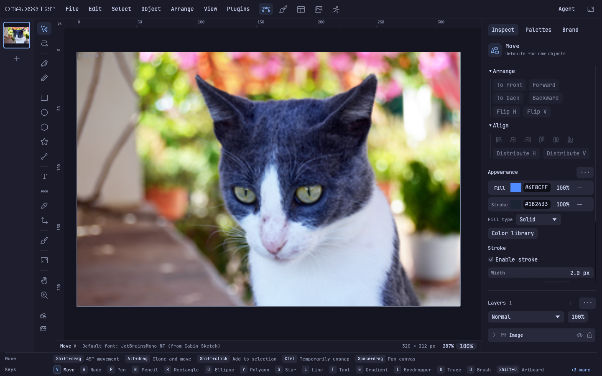
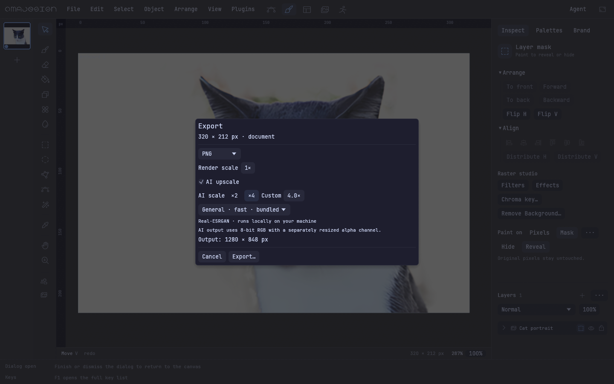
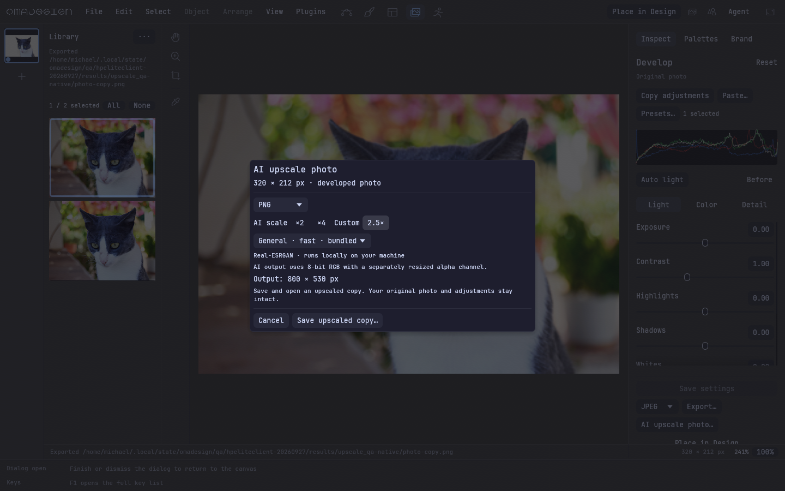
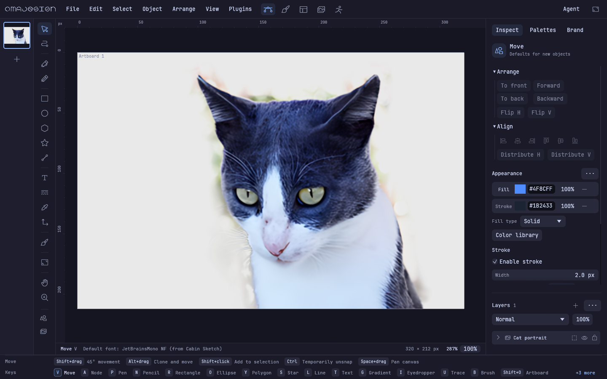
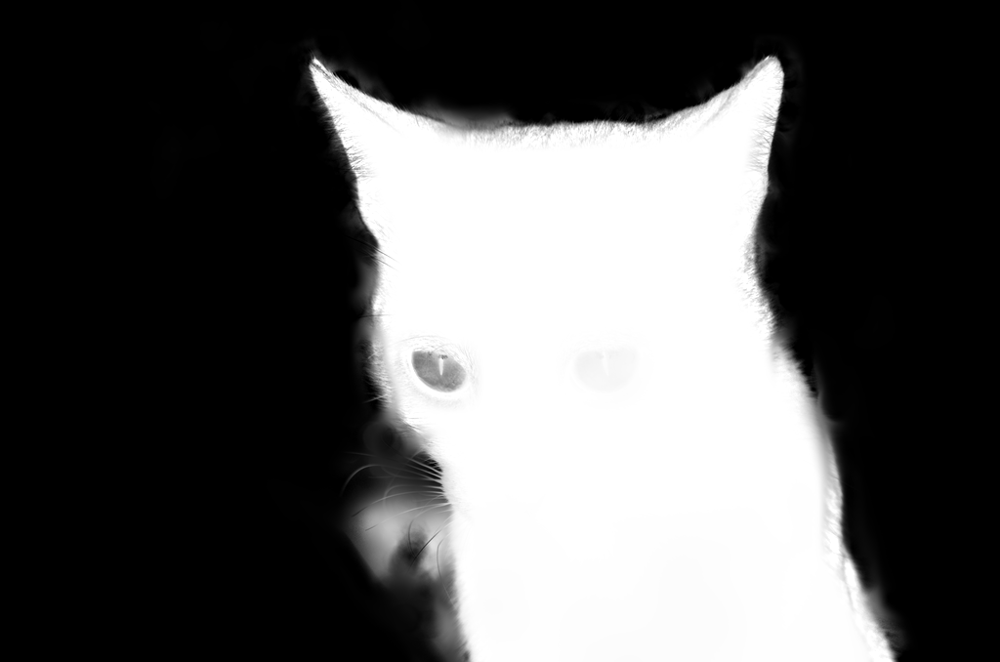

# hpeliteclient: installed x86_64 upscaling and background-removal QA

PR #147, code commit `221834bdd8af5aee8554a0e835629cbe2f467558` (version 0.6.0).
The portable x86_64 build was installed through its installer into the user's
normal `~/.local/bin/omadesign` and `~/.local/share/omadesign` locations over LAN.
The prior executable and existing application data were backed up first under
`~/.local/state/omadesign/qa/hpeliteclient-20260927/backup/` on the target.

**Result: the workflows work offline on this machine, but AI upscaling is not
fast under its current desktop load. Background removal is useful for small
images. Native interaction checks pass, with substantial frame-time spikes.**
This is functional x86_64 coverage, not a smooth-performance signoff.

The follow-up [everyday authoring report](authoring-hpeliteclient-2026-09-27.md)
rebuilds the user's infographic as editable artwork and measures real Pen,
Brush, typing, pan and zoom interactions. Those workflows also pass correctness
checks but fail the responsiveness check on this loaded host.

## Hardware and installed artifact

- Four AMD Ryzen Embedded R2314 cores, integrated Radeon Vega graphics.
- 5,790 MiB usable RAM. At initial inspection only 622 MiB was available and
  3,457 MiB of swap was already occupied. Existing desktop applications remained
  running throughout the tests; load and memory pressure varied considerably.
- Arch Linux / Omarchy, Mesa and vulkan-radeon 26.2.2. Inference uses CPU ORT;
  native rendering uses WGPU. No optional large models were needed or installed.
- Balanced power profile / schedutil. Sampled CPU frequencies ranged from about
  750 MHz to 1.6 GHz during work. The underlying reason was not established;
  temperature sampling showed 66.75 °C CPU. No host power policy was changed.
- Archive SHA-256:
  `3c63e6e6d499ab142f57e00b2d69e8811813815b972f937e616de00fed0911e4`.
- Installed binary SHA-256 matches the archive:
  `fd293af0d47e2bfda8550a1c2107177060b8e0a9d41785f299c9f5849f9091d8`.

[Installation record](hpeliteclient-2026-09-27/installation.json),
[sensor sample](hpeliteclient-2026-09-27/sensors.json).

## Measured work

These are whole-process wall times and peak process RSS, including model/session
loading and output encoding. The background-removal CLI also writes three
comparison variants. The bundled models are General x4v3 and U²-NetP. Every model
operation below ran with networking disabled through `unshare -Urn`, with an
isolated profile and the installed runtime selected explicitly.

| Operation | Input → output | Wall time | Peak RSS |
| --- | --- | ---: | ---: |
| Background removal | 320 × 212, same-size mask | 2.83 s | 316 MiB |
| Background removal | 1,024 × 678, same-size mask | 27.33 s | 528 MiB |
| AI 2×, normal priority | 320 × 212 → 640 × 424 | 19.20 s | 100 MiB |
| AI 2×, normal priority | 1,024 × 678 → 2,048 × 1,356 | 165.42 s | 136 MiB |
| Initial AI 2× sample | 320 × 212 → 640 × 424 | 42.82 s | 101 MiB |
| Initial AI 4× sample | 320 × 212 → 1,280 × 848 | 34.91 s | 101 MiB |

The initial samples used a lower CPU scheduling weight of 50; subsequent normal
priority, native and affinity tests used the default weight of 100. There was
no CPU quota. Four-core 2× runs varied from 19 to 43 seconds, so the initial
numbers should not be treated as stable throughput predictions.

Single-CPU and two-CPU affinity experiments on the small 2× operation took
20.09 s and 13.85 s respectively, both about 100 MiB. These were QA-only process
restrictions. They suggest testing a lower worker count further, but changing
desktop load means they do not establish a controlled speedup. The installed
application's worker settings remain those of the reviewed build.

The QA service had a 768 MiB memory ceiling and 512 MiB swap ceiling. Its
accumulated file cache reached the memory ceiling and was reclaimed; **no
cgroup OOM or kill occurred**. Peak process RSS above is distinct from aggregate
cgroup accounting. A 5× timing sample was deliberately terminated after 117 s
to prioritize native QA; it is not counted as a completed result. No 2,048- or
6,000-pixel input stress run was performed here.
[Scope and resource limits](hpeliteclient-2026-09-27/scope-and-limits.json),
[1,024-pixel upscale](hpeliteclient-2026-09-27/upscale-1024-2x-resources.json),
[1,024-pixel removal](hpeliteclient-2026-09-27/background-1024-resources.json).

## Native and installed behavior

The actual installed executable first opened and rendered the fixture. The two
native QA executables were cross-built locally from the same code, copied to
the target, and exercised the application UI through real egui pointer and
keyboard events. They loaded the target's installed ONNX Runtime. Export paths
were supplied through the native host callback; the desktop chooser itself was
not automated on this host.

- **Background removal:** cancel preserves source/history; preview and matte
  refinement work; Apply is one undo step; undo/redo and saved .oma reopening
  retain the mask; source pixels stay unchanged. 23.71 s whole process,
  437 MiB peak RSS. [Native assertions](hpeliteclient-2026-09-27/background_removal_qa-native.json).
- **Upscaling:** upscale-first and upscale-cutout align pixels/masks and retain
  placement; each Apply is one undo step; undo/redo and .oma reopening work;
  cancelling a job preserves the document; cancelling export leaves no partial
  file; document 4× export and Photo 2× / custom 2.5× copies save and reopen with
  exact dimensions. 152.56 s whole process, 632 MiB peak RSS.
  [Native assertions](hpeliteclient-2026-09-27/upscale_qa-native.json).
- The installed application subsequently reopened the saved upscaled cutout
  offline and rendered it with its original canvas placement. A final verifier
  checked seven PNG dimensions, cancellation cleanup, empty model caches and
  installed-binary hash parity. [Final verification](hpeliteclient-2026-09-27/final-validation.json).
- **Responsiveness limitation:** background-removal UI-update p95 was 161 ms,
  maximum 478 ms; upscaling p95 was 242 ms, maximum 504 ms. These measure time
  inside the UI update, not display FPS. Frames and cancellation continued during
  inference, but this loaded, memory-constrained run visibly falls short of a
  consistently smooth interaction target. Native capture work and the test's
  memory guard also form part of these test conditions.

The inspected mask retains the subject silhouette and has no visible tile grid;
fine fur/whiskers and some interior confidence remain imperfect with the bundled
fast model, as in the existing model QA. This does not claim pixel-perfect
automatic matting.

## Reproduction and retained evidence

The target's complete inputs, results, native screenshots, saved documents,
logs, isolated profiles, archive and backup remain under
`~/.local/state/omadesign/qa/hpeliteclient-20260927/`. A local copy of reports is
under `target/hpeliteclient-qa/`. The [measurement runner](hpeliteclient-2026-09-27/run_qa.py)
records `wait4` wall/CPU/RSS data and before/after host memory pressure. It expects
`bin/upscale_qa`, `bin/background_removal_qa`, and the named fixtures in `inputs/`
beside it. Its `baseline`, `background`, `native`, `typical`, and `installed`
modes reproduce the final checks. Run via the target's user service manager to
inherit the active Wayland session, with the documented memory limits.

Desktop cross-builds ran locally with the repository's Zig wrappers and GLIBC
2.35 target, not on the thin client. Only QA evidence was added after testing;
the installed application code remains commit `221834bd`.

Fixture: **Katze Portrait** by **Anton Porsche**,
[Wikimedia Commons](https://commons.wikimedia.org/wiki/File:Katze_Portrait.jpg),
[CC BY-SA 4.0](https://creativecommons.org/licenses/by-sa/4.0/). The same original
and attribution are documented in [the main upscaling report](upscaling-2026-09-27.md).
Photo derivatives/captures retain CC BY-SA 4.0. Changes: resizing, AI upscaling,
background masks, and native UI captures.
