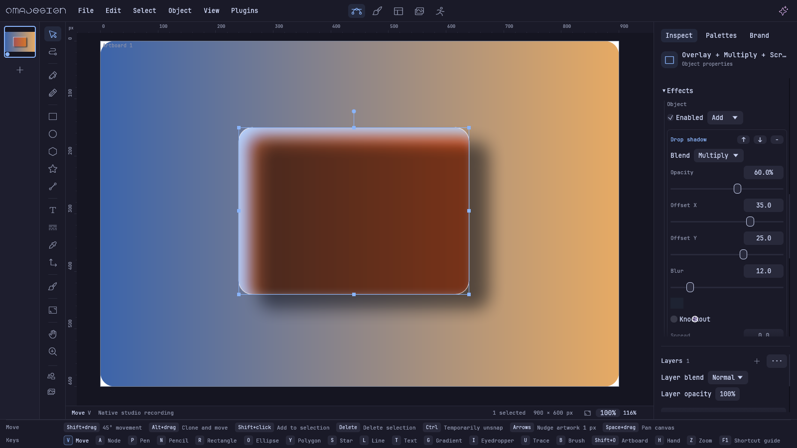
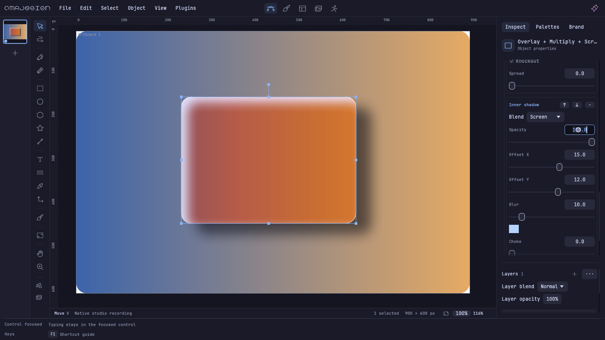
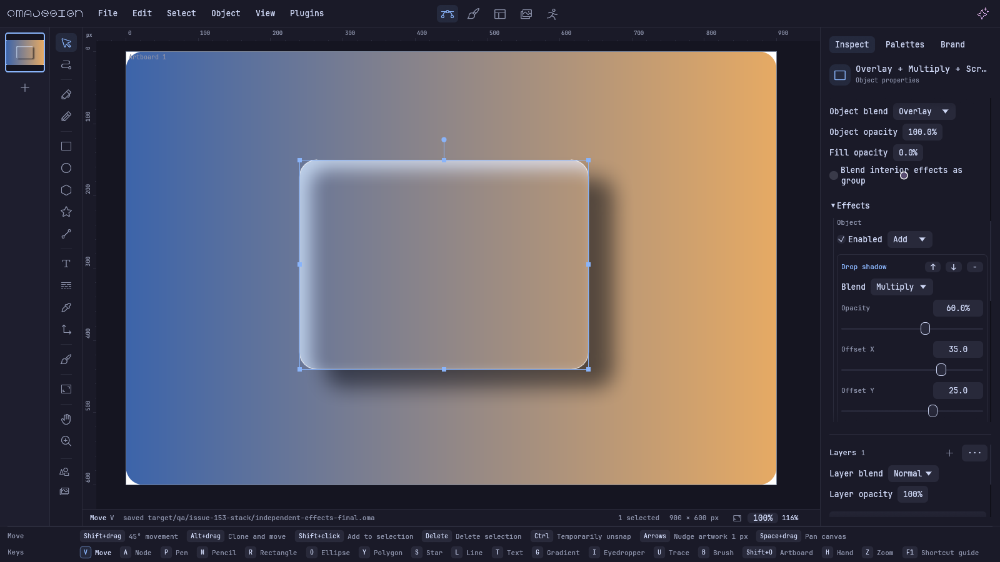

# Issue 153 — independent object and effect appearance

[Native end-to-end recording](independent-effects.mp4) · [machine-readable result](result.json) · [saved editable project](independent-effects-final.oma)

The recording was rerun after integration on PR #161 and contains 230 actual native WGPU viewport frames at 1600×900. Only the
initial gradient document and two default effects are seeded. Every recorded edit
uses the real inspector through egui pointer/keyboard input. Each frame waits for
render readiness; the 23-second, 10 fps playback is a deterministic input replay,
not a realtime performance benchmark. Configuration, caches and saves use an
isolated process profile. The installed stable application and human QA evidence
are untouched.

The workflow sets object Overlay, shadow Multiply at 60%, and inner shadow Screen
at 80%. It toggles Knockout off/on, sets Fill opacity to 0 while retaining effects,
toggles interior grouping, undoes/redoes, and saves using Ctrl+S. The harness checks
those exact document values. Reopening the saved file produces byte-identical PNG
pixels. The error array is empty.





Reproduce from this checkout:

```sh
cargo build --locked --bin capture_studios
WINIT_UNIX_BACKEND=x11 DISPLAY=:0 target/debug/capture_studios independent-effects /tmp/omadesign-153 --fps 10
```

[Regression log](tests.log): 49 focused checks passed. Regression coverage includes
a gradient-backdrop pixel golden, independently
computed Overlay reference samples, SVG/native per-effect pixel parity without
blur approximation, knockout, interior grouping, whole-object opacity
interpolation, layer effects, all glow/overlay variants, normal-effect fast-path
parity, undo/redo, v6 appearance migration, save/reopen, clipboard, Lua defaults and
range validation, and real-input mixed-selection/layer-control isolation. The
resized Effects panel test exercises every effect catalog entry. Test binaries are
copied before execution so fresh-process font portability checks can safely spawn
the same executable while unrelated builds run.

SVG keeps separate effect elements and reports Gaussian blur / partial group
opacity approximation. PSD reports that per-effect backdrop modes are flattened
into layer pixels; its compatibility composite retains the complete document.
PDF rasterizes affected layers/pages where needed. These export boundaries are
also exposed by the application's existing warning channels.

## Normal/100% timing comparison

`cargo run --locked --bin effects_bench` compares the retained pre-153 renderer
(`legacy_composite=true`) and the independent appearance path in one executable.
Both use six rounded rectangles with one Normal/100% shadow each and knockout off,
at 512×384. Rendering is asserted byte-identical before timing. Three warmup frames
per path precede nine alternating rounds of eight renders per path (144 measured
frames); see `benchmark.json` for all samples. The median was **205.120 ms legacy
and 205.416 ms independent (+0.145%)**, within the observed round-to-round variation
(about 2%). This is an unoptimized local CPU compositor comparison, not a WGPU
presentation or release-build frame-rate claim. The compatible single-effect path
now reuses the original local effect application and one transformed blit.
