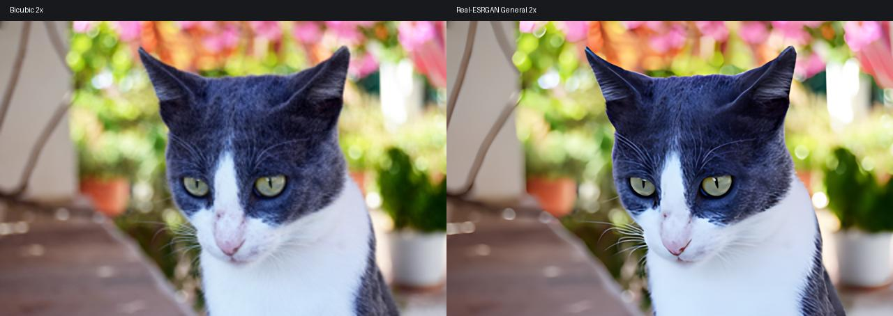
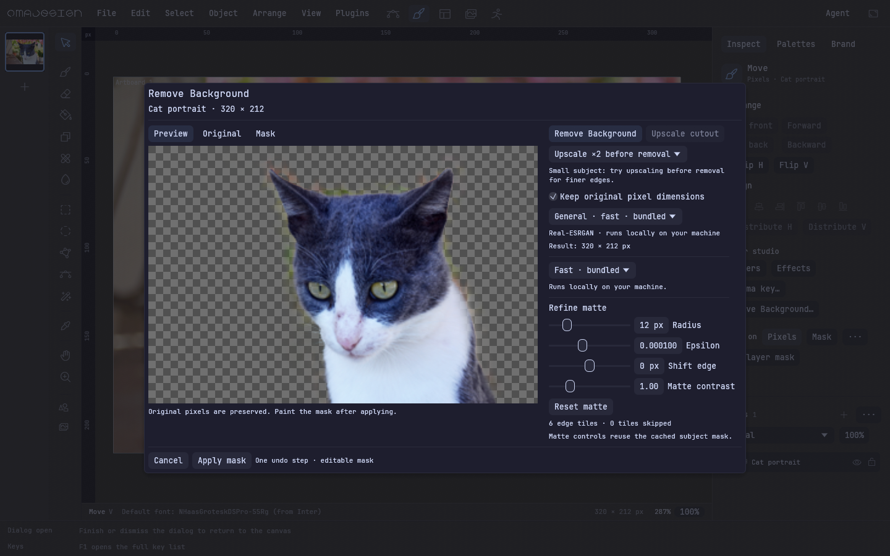
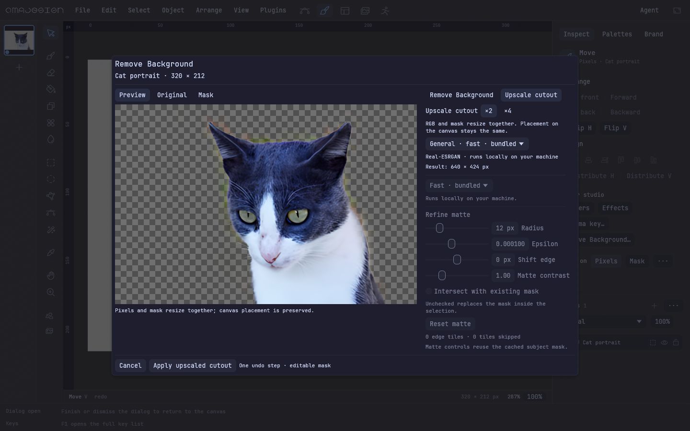
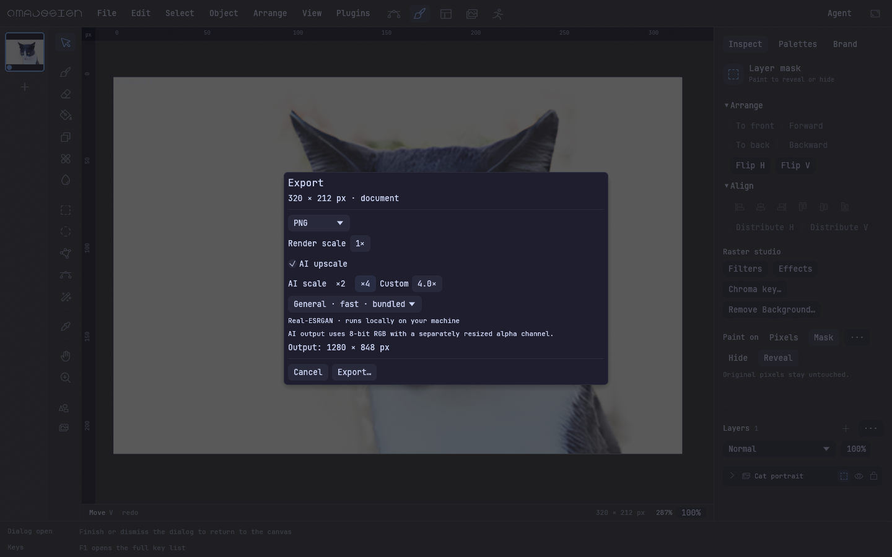
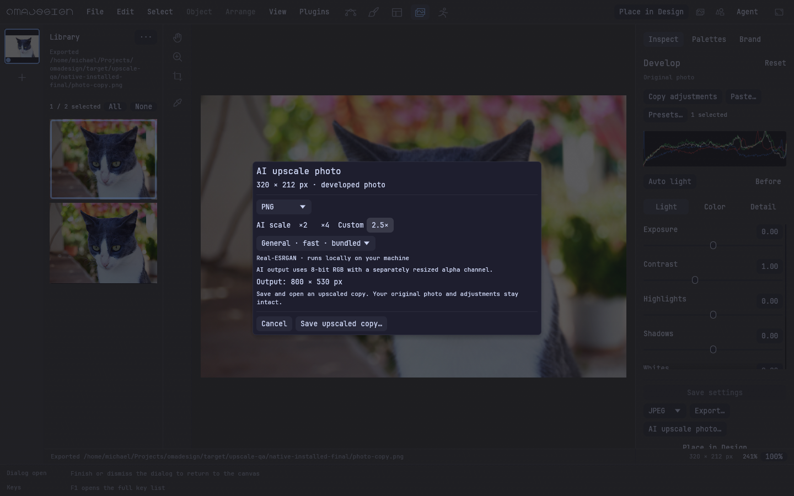
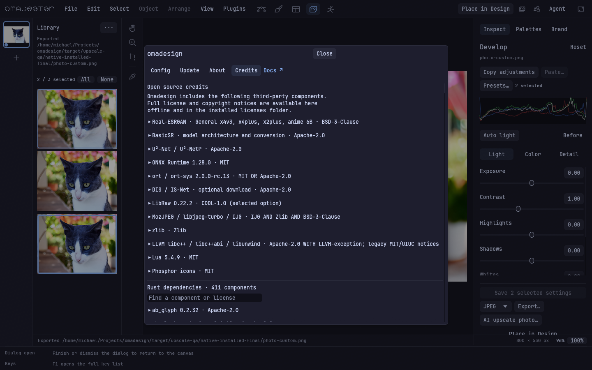

# Offline AI upscaling — issue #145

Stacked on PR #146 (`aa0054675f1cd5a4247e72412a4995d4c1484625`), which is stacked
on PR #142. This implements Photo upscaling, the still-export dialog, and the
upscale-first/upscale-cutout items deferred by #144. CPU is the shipped provider;
no ncnn/Vulkan subprocess, Upscayl code, or Upscayl-only models are included.

## Behavior and boundaries

- General x4v3 is embedded (4,866,419 bytes) for fresh-install offline use. The
  three optional models use the shared atomic downloader, verify pinned size and
  SHA-256 before installation, and verify again on every load. The
  [model-only release](https://github.com/michaelmonetized/omadesign/releases/tag/upscale-models-v1)
  is a prerelease excluded from latest, with no application update archives.
- The converter pins upstream source revisions and weight hashes, uses fp32
  opset 17, dynamic H/W and batch 1. All four conversions reproduced identical
  hashes on a second run. The manifest records all architecture settings and
  source/state-dictionary choices. Python/PyTorch are build-time tools only.
- One 192-pixel core tile enters ORT at a time, with a 40-pixel General halo
  (covers its receptive field) or 64-pixel RRDB halo. Output borders are cropped;
  resampling coordinates refer to the whole image. Native x2 uses even padded
  tile coordinates to preserve pixel-unshuffle phase. Intermediate passes use
  native scale; the final pass writes the exact requested size directly, avoiding
  a full native-4× intermediate for 2×/custom output. Alpha is resized separately.
- Inference activation storage is bounded by tile size and batch 1. Source and
  output pixel storage still grows with image dimensions. Raster export supports
  up to 512 megapixels / 65,536 pixels per side, subject to available memory;
  Pixel operations and Photo copies support 64 megapixels.
- File → Export / Ctrl+E selects format and render scale, plus AI 2×/4×/custom
  for PNG, JPEG and TIFF. SVG/PSD/PSB/PDF/ORA retain their existing vector/layered
  encoders and reject AI. The selected format is checked against the save path.
- Photo AI upscale saves and opens a developed copy. Original photo/settings
  destinations are rejected. AI output is 8-bit RGB; non-AI RAW PNG/TIFF retain
  the existing 16-bit path. The dialog reports exact final dimensions.
- Pixel's upscale-first supports keeping the original grid or retaining the
  enlarged grid. Upscale cutout resizes RGB and mask together. One history
  command retains the displayed layer size (including implicitly sized paint
  layers), origin, rotation and shear; undo/redo and .oma persistence include
  both grids. Matte adjustments reuse prepared pixels and cached inference.
- Work and encoding run through `ui/jobs.rs`; progress includes passes/tiles.
  Cancellation terminates ORT between operators, rejects late previews, and
  removes unfinished export files. Replacement is atomic after encoding and
  successful cancellation checks. Changed source/selection ownership is rejected.
- Credits and packages include the Real-ESRGAN BSD-3-Clause and BasicSR Apache-2.0
  texts alongside the base PR's U²-Net, ORT, ort, and native/Rust notices. Neither
  pinned Real-ESRGAN nor BasicSR root supplies an Apache NOTICE file for these
  components. The accepted 0.5.0 human-QA record is unchanged.

## Real images and numeric results

The fixture is **Katze Portrait** by **Anton Porsche**,
[Wikimedia Commons source](https://commons.wikimedia.org/wiki/File:Katze_Portrait.jpg),
[CC BY-SA 4.0](https://creativecommons.org/licenses/by-sa/4.0/), reused from the
base PR's QA. Original SHA-256:
`f19c9ff82c63afa226f527e6ae5d2deb9a79a5a3b6c6367b2b59782115e0ecb7`.
Photo portions of screenshots and comparisons retain CC BY-SA 4.0. Changes:
resizing, development, AI upscaling, background removal, and comparison labels.
The 6,000-pixel stress fixture resizes the original 4,928 × 3,264 photo to
6,000 × 3,974 to exercise large allocations and tiling.



- 320 × 212 → **640 × 424** (2×), **1,280 × 848** (4×), and **1,600 × 1,060**
  (5×, two passes) completed with networking disabled. General times were
  1.11 s, 1.04 s and 19.56 s respectively; these are local measurements.
- General 4× tiled versus single-tile inference was **pixel-identical**, with
  maximum/mean channel difference **0**. HQ x4plus's larger receptive field
  yielded maximum 3/255 and mean about 0.012/255. No visible grid seams appeared
  in the inspected comparison. [General](upscaling-2026-09-27/seams.json),
  [HQ](upscaling-2026-09-27/quality-seams.json).
- All three optional models downloaded via the actual application downloader
  and ran: native x2 4.73 s, illustration 5.77 s, HQ x4plus 18.57 s on the small
  fixture. Cached inference was also exercised with networking disabled. Native
  x2 correctly cropped odd **85 × 98 → 170 × 196** input/output.
- A same-size model with one altered byte was rejected before inference and
  wrote no output. [Corruption check](upscaling-2026-09-27/corruption.json).
- **6,000 × 3,974 → 12,000 × 7,948**, 672 tiles, CPU, no network: **492.74 s
  inference**, **494.24 s whole process**, **559,760 KiB peak RSS (546.64 MiB)**.
  [Dimensions/timing](upscaling-2026-09-27/large-2.json),
  [process resources](upscaling-2026-09-27/large-resources.json).
- The real export pipeline verified 2×, 4×, 5× and 2.5× developed Photo output in
  PNG/JPEG/TIFF, including rotation, crop and exposure. Pixel pre-upscale 2×
  with original grid retained, 4× with larger grid, and cutout 2×/4× all kept
  alpha and mask dimensions aligned. Cancellation preserved an existing export
  destination byte-for-byte with no temporary output left behind.
  [Pipeline results](upscaling-2026-09-27/pipelines.json).

## Native, installed and package verification

The final native WGPU harness ran with networking disabled (`unshare -Urn`) and
an empty, isolated model cache. It used the runtime from the staged ARM64 archive
installation, confirmed by the loader's `LD_DEBUG=libs` initialization path.
It exercised real pointer/keyboard events: upscale-first, upscale-cutout,
Apply as one undo step, undo/redo, save/reopen, cancellation without document
changes or partial files, 4× document export, and 2× / custom 2.5× Photo copies
saved and opened. **1,079 frames**, **0.72 ms p95 / 36.41 ms maximum** UI frame
processing time; 276 frames continued during the first inference operation.
[Native results](upscaling-2026-09-27/native-result.json),
[installed/offline evidence](upscaling-2026-09-27/installed-offline.json).

The harness supplies save destinations through the native host callback. A
separate check launched the actual installed portable application, used Ctrl+E,
selected AI 2×, and saved through the **Synchro desktop portal chooser**. The
result reopened as 640 × 424 with alpha. That chooser check uses the normal
session because the desktop portal authenticates its session DBus client.
[Desktop chooser result](upscaling-2026-09-27/desktop-chooser.json).
The final archive-installed application also reopened the saved upscaled .oma
and rendered a native WGPU capture with networking disabled.

Both ARM64 and x86_64 portable archives were built locally with Zig and passed
the GLIBC **2.35** ceiling check for the executable and bundled runtime. Final
assembly used `package()` from `scripts/release.sh`. Archive license contents
were compared with the checked-in originals. The installed ARM64 binary hash
matches its archive. x86_64 was cross-built and inspected, not executed.
[Package and binary hashes](upscaling-2026-09-27/packages.json).

Native visual inspection caught and fixed an implicitly sized raster layer
expanding on the canvas when its grid grew. The history command now retains its
effective displayed size, and undo restores the original implicit size. Native
captures and the regression test verify placement as well as grid/mask alignment.







## Checks and reproduction

- Final library suite: **700 passed, 0 failed, 5 existing ignored**.
- All-target offline check, feature-module formatting, `git diff --check`, and
  installer/release shell syntax checks passed. The base PR already records
  unrelated repository-wide formatting differences inherited from #142.
- Desktop compilation, native QA and portable builds run locally.

```sh
sh scripts/prepare-ml-runtime.sh
CARGO_PROFILE_RELEASE_LTO=false cargo build --release --bin omadesign --bin upscale_qa --locked --offline
cargo test --lib --locked --offline
cargo check --all-targets --locked --offline
unshare -Urn target/release/upscale_qa target/upscale-qa/cat-small.png target/upscale-qa/result.png 2
unshare -Urn target/release/upscale_qa target/upscale-qa/cat-small.png target/upscale-qa/pipelines --pipelines
unshare -Urn target/release/upscale_qa target/upscale-qa/cat-small.png target/upscale-qa/native --native
sh scripts/release.sh
sh dist/omadesign-0.6.0-aarch64-unknown-linux-gnu/install.sh --prefix "$PWD/target/upscale-qa/install"
```

Full-resolution outputs, profiles, logs, saved .oma files and installation
directories remain under `target/upscale-qa/`. No application release, automatic
update, fleet deployment, merge, or new human-QA signoff is claimed by this PR.
